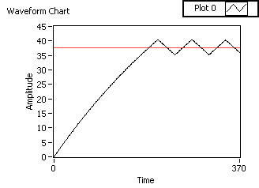
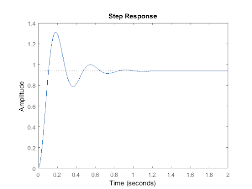

# claw-control 
🕹 A collection of control theory algorithms for robots.

## [Dead Reckoning](https://en.wikipedia.org/wiki/Dead_reckoning#:~:text=In%20navigation%2C%20dead%20reckoning%20is,and%20course%20over%20elapsed%20time.)
Dead reckoning is a very elementary method of robot control. By using predetermined gains we can tell a vehicle to reach a target position. An example of this would be `go 5 m/s for 2 seconds` to reach a target 10 meters away. This method of control is very simple and easy to implement, however, it has many flaws. The main issue with dead reckoning is that it's inaccurate. Because there is no feedback control, a vehicle that is being controlled using dead reckoning can be affected by outside forces like collisions and static friction (stiction).

## [Bang-Bang](https://en.wikipedia.org/wiki/Bang%E2%80%93bang_control)
Bang-Bang control (AKA 2 step, on-off control, hysteresis control) is a more accurate method of control compared to dead reckoning. Unlike dead reckoning, bang-bang control uses a feedback control loop. This means it requires some sort of sensor or feedback device that sends data for the controller to act on. An example of a bang-bang controller would be an air conditioning system, let's say we want to keep the temperature of a room at 70° C: `if the temperature is greater than 70°, cool the room; if the temperature is less than 70°, heat the room`. Although bang-bang control loops are generally better than dead reckoning, they aren't without their issues. The main problem with bang-bang control is oscillation, especially in real life with factors like acceleration and friction.
 
 

## [PID](https://en.wikipedia.org/wiki/PID_controller)
PID stands for Proportional Integral Derivative. PID control loops are one of the most common control methods used. With PID we can reach a target very accurately and also tune it to our specific needs. A very common example of PID control in action is the cruise control system in a car. Let's say we wanted to maintain 55 MPH, we can't just give a constant speed value to the motors because things like hills would slow it down. To overcome this we can use PID control. A PID controller can maintain a setpoint regardless of external variables.
 
 

## 👨‍💻 Contact
Linkedin: [Raadwan Masum](https://www.linkedin.com/in/raadwan-masum/)
 
Github: [raad1masum](https://github.com/raad1masum)
 
Devpost: [Raadwan masum](https://devpost.com/raad1masum)
